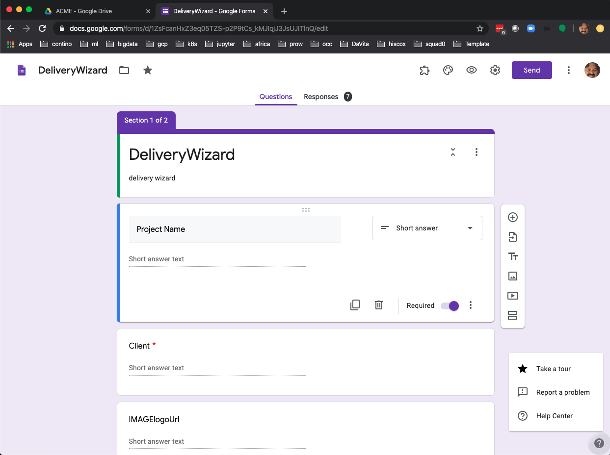

# FormTemplate
Google Form Add-on to automate the deployment of templatized resources.

## Try it out
* Open/create a Google Form.
* Install the FormTemplate from the Add-ons MarketPlace (must be logged in to contino G-suite domain)
* Accept authorizations to complete installation.
* Click Add-ons & **FormTemplate** & Open.
* Fill in the form with desired value for each ${} Variable. 
* Submit the form to copy the templated resources and apply the templating.

## Forms and Templates
* [DeliveryWizard](https://docs.google.com/forms/d/1ZsFcanHxZ3eq05TZS-p2P9tCs_kMJIqjJ3JsUJITlnQ/edit)
* [TestTemplate](https://docs.google.com/presentation/d/1fqtCE8iTxzaf1ZgcICB_qb4cjEaFoOuXnj9xG6PlMH8/edit#slide=id.g5e5b0c9b58_0_1)
* [Standard Project Kickoff](https://docs.google.com/presentation/d/1bb_Dw5Hyvb8POGhNyoLSxw9dIwKMgKsv7CUBFJarf8s)
* [Data Strategy Pitch Template](https://docs.google.com/presentation/d/1LYlnNRtLgAOS29H29M5cUGtHKIVFtpKJsvPIzQzQi0U/edit#slide=id.g7ebd95ecfd_0_316)

## Publish
* In Script Editor, select "Resources" & "Cloud Platform project...".  Join to existing "standard" GCP project using the project number (Project Number = 599254386247 https://console.cloud.google.com/iam-admin/settings/project?project=arched-run-214623 )
FormTemplate is published to the G-Suite marketplace for just Contino.io G-Suite domain.
* Under "File" & "Manage versions" create/select a version.
* Under "File" & "Project properties" note the Project Key MpEWpV9GCmTyHANsCxvtUJrlUvHYZZW4p
* Under "File" & "Project properties" note "Scopes"
https://www.googleapis.com/auth/calendar
https://www.googleapis.com/auth/drive
https://www.googleapis.com/auth/presentations
https://www.googleapis.com/auth/script.external_request
https://www.googleapis.com/auth/tasks
* "APIs & Services" & "OAuth consent screen"
** Application tye: Internal
** Application name: FormTemplate and pick logo 
* "APIs & Services" & "Credentials": create credentials drop-down menu, select OAuth client ID, Application type=Web, fill in the resulting form if needed. Click Create when finished, download your credential file containing your client ID and client secret.
https://console.cloud.google.com/apis/credentials/oauthclient/599254386247-n50a9np8gtjc4a027lgdfbm0s2qal0dm.apps.googleusercontent.com?project=arched-run-214623
* Enable G Suite Marketplace SDK 
* "Configuration"
https://console.cloud.google.com/apis/library/appsmarket-component.googleapis.com?q=Marketplace&id=1e37cda3-dfcf-4c07-9bec-fa8b595aa4d5&project=arched-run-214623&authuser=0&folder&organizationId
** Fill in required values
** Add Oauth 2.0 Scopes from above
** Forms add-on: MpEWpV9GCmTyHANsCxvtUJrlUvHYZZW4p and version from above
** Visiblity: My Domain (only contino.io)
* "Publish"
** Fill in required values
** Developer website: https://github.com/contino/FormTemplate
** Post Install Tip: Fill out form and submit to generate templated assets
** Category: Office Application
** All regions

## Install
* quicklink: https://gsuite.google.com/marketplace/mydomainapps
* or in Add-ons marketplace, search for "FormTemplate"
* From "Script editor" & "Edit" & "Current Project's triggers", add trigger: OnSubmit, Head, From form, On form submit, Notify me immediatlye

bhood gcp account, project https://console.cloud.google.com/apis/api/appsmarket.googleapis.com/overview?project=formtemplate
* https://developers.google.com/gsuite/add-ons/how-tos/editor-publish-overview
* https://developers.google.com/gsuite/add-ons/how-tos/publishing-editor-addons

## Dev set up (embedded)
* Your form should have question "titles" which match those used in the templated resources. Create a new Google Form and add some variables or use an existing Form that has questions already.
* From within your form, select the "three dots" in upper right corner and Script editor. If you are presented with a welcome screen, click Blank Project.
* Delete any code in the script editor and rename Code.gs to formtemplate.gs.
* Replace any code in these two files with the following content, respectively:
[formtemplate.gs](template.gs)
* Under the "Resources" & "Advanced Google Services", select Calendar API, Drive API, Google Docs API, Google Sheets API, Google Slides API, People API, and Tasks API
* Select the menu item File > Save all. Name your new script "FormTemplate" and click OK. The script's name is shown to end users in several places, including the authorization dialog.
* Switch back to your Form and reload the page.
* Fill out the response to the questions and click "Send" button.
* The first time you will get a dialog box indicates that the script requires authorization. Click Continue. A second dialog box requests authorization for specific Google services. Click Allow. This step needs to be done once.

## Learn more
* [Apps Script Slides API](https://developers.google.com/apps-script/reference/slides)
* [Extending Google Slides](https://developers.google.com/apps-script/guides/slides)
* [Translate](https://developers.google.com/apps-script/guides/slides/samples/translate)
* https://developers.google.com/gsuite/add-ons/editors/slides/quickstart/translate
* [Doc Variables](http://docvariables.com/) is similar, but no source
* https://docs.google.com/presentation/d/1bb_Dw5Hyvb8POGhNyoLSxw9dIwKMgKsv7CUBFJarf8s/edit#slide=id.g5e5b0c9b58_0_1
* https://developers.google.com/gsuite/add-ons/editors/slides
* https://codelabs.developers.google.com/codelabs/apps-script-intro/#6
* https://groups.google.com/forum/?utm_medium=email&utm_source=footer#!forum/doc-variables----support-and-requests
* https://zapier.com/apps/google-sheets/integrations/miro
* https://github.com/gsuitedevs/apps-script-samples
